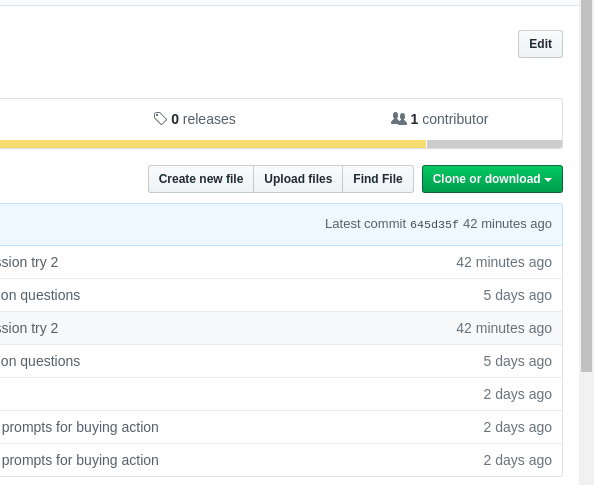

# bamazon

### Introductions

1. Have you ever felt like there needs to be a command line shopping interface?
2. Have you ever felt like the larger shopping apps are too cumbersome?
3. Have you ever wanted to shop items from the future?

##### _Well LOOK NO FURTHER_!

#### Introducing the BAMAZON APP!!!!!

### So what is this???

This application aims to help solve the cumbersome modern online shopping problem by providing a simple and easy to understand user interface and organizing the necessary data in such a way that users/customers can quickly understand where and how they can buy their product.

### So how do I use this?

1. First and foremost, make sure you clone this repository as shown below:

    

2. Then, navigate to the place that you want to clone the directory and place it there by typing `git clone https://github.com/peterztan/bamazon.git`, as shown below:

    