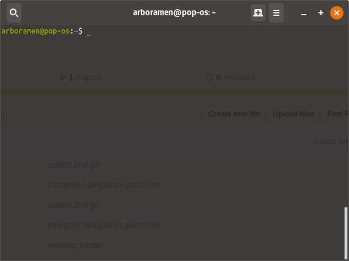

# bamazon

### Introductions

1. Have you ever felt like there needs to be a command line shopping interface?
2. Have you ever felt like the larger shopping apps are too cumbersome?
3. Have you ever wanted to shop items from the future?

##### _Well LOOK NO FURTHER_!

#### Introducing the BAMAZON APP!!!!!

### So what is this???

This application aims to help solve the cumbersome modern online shopping problem by providing a simple and easy to understand user interface and organizing the necessary data in such a way that users/customers can quickly understand where and how they can buy their product.

### So how do I use this?

1. First and foremost, make sure you clone this repository as shown below:

    

2. Then, navigate to the place that you want to clone the directory and place it there by typing `git clone https://github.com/peterztan/bamazon.git`, as shown below:

    

3. Proceed to the bamazon root folder, and then type `npm i` to install the application dependancies:

    

4. In the bamazon root folder, type `node bamazonCustomer.js` to initiate the CLI:

    

5. As you can see, the CLI has started, and you can navigate around using the options given on screen:

    

6. It can be seen from above that when you choose a category, you can see the inventory associated with that category, from there, you will be asked whether or not you want to buy an item, where you can use the id shown in the inventory table to choose the specific item you want, and specify the amount of that item that you would like to purchase:

    

7. From here, it will be shown below a normal workflow of the buying process:

    

    * Here you can see that you have the option to go back to the previous category menu after your purchase in case you wanted to buy something else; or the same thing if you changed your mind and wanted one more of the same item. The system then reduce the stock of that item by the amount that you decided to buy.
    * The system also gives you a total of what your bill will likely be, and since it is based on a Utopian society where no sales taxes are forced upon online transactions, you only have to pay for the raw total (HURRAY!!!)

8. Sometimes it's tough being a customer, and we GOTCHU, below shows the process/options available if you are not sure what to buy or decided not to want something:

    

    * As you can see, if you are feeling quite undecisive looking at our huge amount of inventory, you have to options to explore around, go back, stare at the Taylor Swift collection for 30 seconds, or exit.

9. What if you feel like buying something, and then suddenly don't want it anymore? No worries, we have a solution for that, we can simply let you cancel your order and even give you the option to go back and browse the other items, or leave. How great is that?!

    